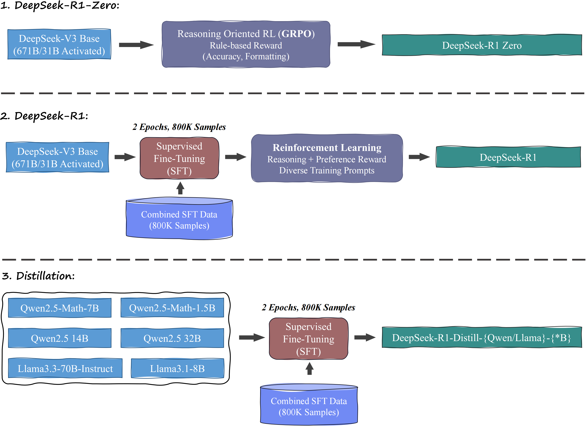
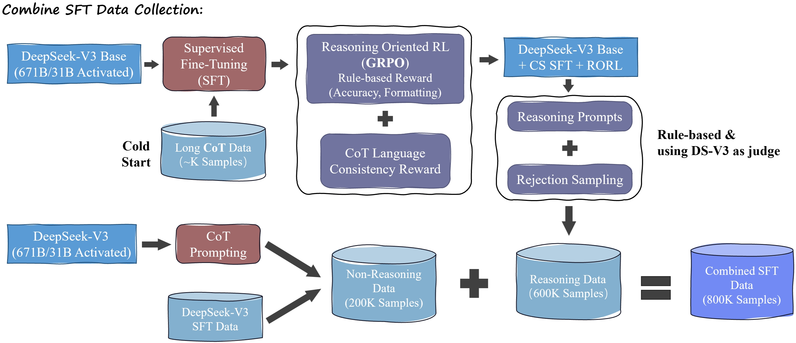

对于 LLM 以及对应的 RL，我还是很陌生的。借着这个机会写点笔记学习一下。

## Pipeline

先整理一下 R1 的整个 Pipeline。整个 R1 报告发布了三组模型：1）DeepSeek-R1-Zero；2）DeepSeek-R1；3）DeepSeek-R1-Distill。三者的训练 Pipeline 如下所示：

其中，用于 R1 本体以及后续蒸馏模型的 “Combined SFT Data” 的构建 Pipeline 如下：

